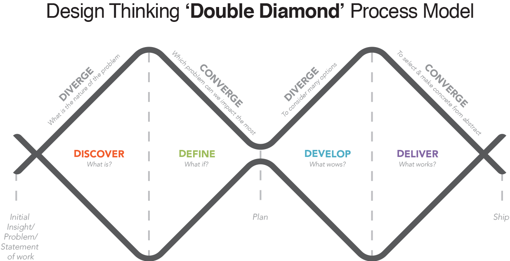
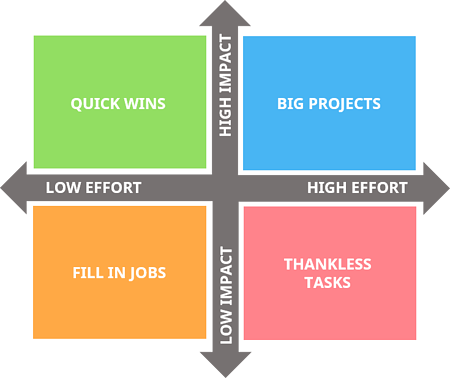

## Ellington Geological Services

#### Digital Strategy Definition

---

## Agile Definition

--

<!-- .element class="plain" height="50%" width="50%"-->

--

<!-- .element class="plain" height="100%" width="100%"-->

---

# Challenges

---

# Ideas

---

# Solutions

--

<!-- .element class="plain" height="75%" width="75%"-->

---

# Actions

---

## Technological as solutions

---

## Domains

--

### The name

1. Something unique. 
2. Something memorable.
3. As short as possible.

--

### Where

Domain name provider ([Ionos](https://www.ionos.com/), [goDaddy](https://www.godaddy.com/)) or bigger player like google, amazon. Domain name providers tend to have better pricing.

---

# Email & Documents

--

### Context

- Domain name providers sometimes have packs of email & domain name.
- Google & Microsoft provide more complete packs for employees to share information on the cloud.
- You could run your own. Complexity and maintainance are up to you.

--

| Service     |Price $/year    | Domain           | Email  | Storage  |Apps  |
| ------------- | :-----------: | :----: | :----: | :----: |:----: |
| Google      | 60-120 / user  | No | Yes | Yes | Yes |
| Microsoft | 60-150 / user   | No | Yes | Yes | Yes |
| Ionos     | 24$ (12 1st) | Yes | Yes | No | No |
| NextCloud | ~150$  | No | No | Yes | Yes |

---

# Storage

--

2 options:
- Run your own server
- The cloud

--

### Run your own server
- You control everything. need to buy & own.
- Cost will depend on energy consumption
- Maintenance and hardware are yours to take

--

### Cloud

- You dont run any of the hardware, you dont buy & own.
- Cost can vary depending on need and scale
- complex pricing.
- Different options: AWS, Google cloud, Azure, DigitalOcean